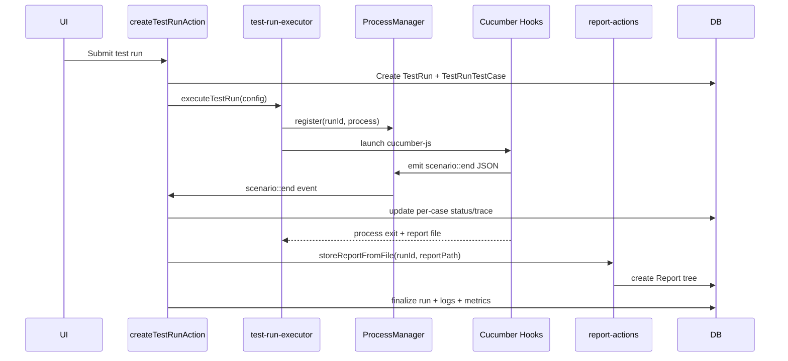

This page describes the runtime lifecycle used by `createTestRunAction` and the test-run executor stack.

## 1. Run creation and selection

1. Client submits test run config (`name`, `environmentId`, selection mode, workers, browser).
2. Server validates with `testRunSchema` and checks unique run name.
3. Server resolves execution scope:
4. `By Tags`: fetches tags and expands matching test cases from case-level and suite-level tags.
5. `By Test Cases`: resolves selected cases, then extracts `IDENTIFIER` tags to constrain execution safely.
6. Creates `TestRun` + `TestRunTestCase` records and marks lifecycle as queued/running.

## 2. Process launch

1. `executeTestRun()` generates a unique report path: `src/tests/reports/cucumber-{runId}-{timestamp}.json`.
2. Environment variables are set (`ENVIRONMENT`, `HEADLESS`, `BROWSER`, `REPORT_PATH`).
3. Cucumber args are composed from tag expression and parallel workers.
4. Child process is spawned (`npx cucumber-js ...`) via `spawnTask`.
5. Process is registered in `ProcessManager` under `runId`.

## 3. Runtime events and traces

1. Hooks in `src/tests/hooks/hooks.ts` track scenario status per step.
2. On scenario end, hook emits JSON event: `scenario::end` to stdout.
3. For failed scenarios, Playwright trace is written to `src/tests/reports/traces/*.zip`.
4. `ProcessManager` parses emitted JSON and re-emits `scenario::end` events internally.
5. Run action listens and updates `TestRunTestCase` status/result/trace path.

## 4. Completion and persistence

1. Process exit resolves run completion.
2. Final logs are formatted and stored in `TestRunLog`.
3. Cucumber JSON is parsed and persisted via `storeReportFromFile()`.
4. Run status/result are finalized and UI paths are revalidated.
5. Metrics updates run for test cases, test suites, and dashboard aggregates.

## Failure-handling notes

- If no identifier tags are available for explicit case selection, run creation is rejected.
- If report file is missing, report storage returns a structured error.
- Process unregister happens on exit to avoid stale in-memory handles.
