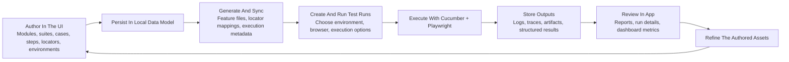

AppraiseJS is a local-first, visual test authoring, execution and analysis platform.
It combines test configuration, authoring, orchestration, and reporting in a single all-compassing app. Unlike other test platforms, AppraiseJS generates test ready artifacts(cucumber[gherkin script] with playwright as the driver) that can be used on any existing test infra.   
At a high level, you model tests in AppraiseJS and the app handles all the messy parts like test script generation, execution orchestration and report generation. Here is the general flow of the app:

1. Configure your environment.
2. Define your test locators using our intelligent locator picker.
3. Create test suites for grouping tests together.
4. Model test flows and group them inside test suites.
5. Run tests using our state of art test runner that allows you to intelligently select test cases or tags to execute in a particular test run.
6. View and analyze test results using our intelligent reporter that allows you to view all relevant test execution metrics in a singular location.

## See it in action

See how easily a user can model test scenarios, run them using our state of the art test runner and view the execution results in our advanced reporter.

<video
  class="overview-demo-video"
  controls
  preload="metadata"
  playsinline
  src="/docs/media/getting-started/overview/overview.mp4"
>
  Your browser does not support the overview walkthrough video.
</video>

## Whom AppraiseJS is built for

- People looking for an open source and no lock-in No-code or low-code test authoring for web automation.
- Organizations looking for a platform with shared usage across a multi dimensional team of Automation Engineers, Manual Testers and Developers.
- Project owners looking forward to ownership of ownable test assets with industry standard test artifacts and schema-backed data.
- Teams looking for easy access tools that can be used by even non-technical stakeholders.

## Core capabilities

- <b>Visual Test Modeling</b>: build test flows using our visual node based
  workflow builder that is easy to understand, composable and reusable across
  various scenarios.
- <b>Test Templating</b>: Compose reusable templates that will allow you to
  quickly form test workflows for fast testing.
- <b>Reusable Selector System</b>: Traditional code based locator managements
  systems are clunky, difficult to remember where a particular locator lives in
  the codebase and requires users to import locators based on page navigation
  steps. Our intelligent locator resolver automatically resolves locators based
  on page route and hands over the exact selector to the executor when it needs
  it.
- <b>Custom Test Node Generation</b>: Besides predefined nodes that are
  available to the AppraiseJS ecosystem by default, it is also possible to build
  your own custom workflow node using our template step builder. Easily define
  new test nodes for your workflow that suites your exact need.
- <b>Environment Aware Execution</b>: AppraiseJS maintains a centralized
  environment management system that can be used at our Test Runner at any time.
  No more loading environment configurations at tests or creating weird hacks
  for loading environment data for a particular test execution session.
- <b>Multi Config Test Orchestration</b>: The fluid test runner of AppraiseJS
  allows users to run tests on multiple different test configurations for
  seamless test execution during test runs. Users are able to formulate test
  runs that can be organized by tags, by test suites or even individual test
  scenarios under a test suite. You can formulate and own your test runs
  according to your necessity without any contradictions.
- <b>State of the Art Test Run Management</b>: Create test runs using your
  preferred test scenario configurations, selected environments, preferred test
  execution surfaces, number of workers and so much with our Advanced test run
  manager.
- <b>Runtime visibility</b>: Our advanced Test Runner allows you to view live
  test run logs, access run artifacts, and inspect execution traces for failures
  all in one test place.
- <b>Reporting</b>: View and analyze test results using our modern test reporter
  that allows you to view and analyze test execution metrics with the help of
  beautiful graphs, charts and data cards.

## Mental model

Think of AppraiseJS as a test control plane with an integrated execution engine:

- Author in UI -> persist in DB.
- Generate/sync Gherkin artifacts.
- Execute with Cucumber + Playwright.
- Parse and store results.
- Explore logs, reports, and metrics in the app.

If the product walkthrough still leaves the handoff points fuzzy, add a single diagram that names the same stages without introducing implementation detail.

The important idea is the loop: AppraiseJS is not just a place to write tests or a place to view results. You author in the app, AppraiseJS turns that model into executable artifacts, execution produces structured feedback, and that feedback flows back into the next authoring pass.

If you want to start using these capabilities immediately, continue to [Getting Started](/getting-started/getting_started) and then [Quick Start](/getting-started/quick_start).
